# 2024-logart

# Pantallas de la aplicación

## Pantalla de inicio (no registrado)

Esta pantalla solo la ves cuando no estás registrado.
  
Cuenta con una flecha semitransparente abajo para indicar que se puede hacer scroll. 
También con un botón para pasar directamente a la pantalla de registro.
  
Para poder usar la app con todas sus funcionalidades debes estar registrado, pero puedes
usar la función de ver objetos de otros usuarios aún sin registrarte (siempre que ellos decidan 
ponerlos públicos). Para ello, pulsaremos en el botón del menú arriba a la derecha y buscaremos
por username.
  

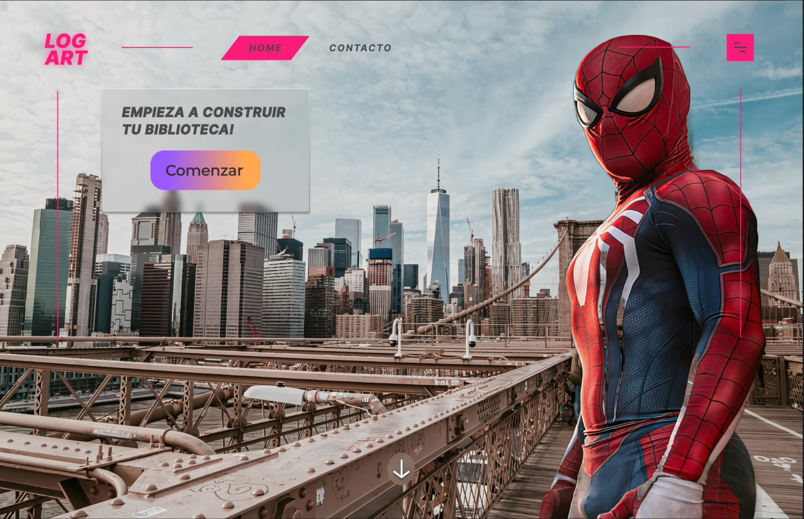 

Al bajar un poco, tienes el carrusel, donde se muestran varios ejemplos en pequeño, y siguiendo el estilo del disco de vinilo, es un carrusel infinito donde se van repitiendo las imágenes.
  

Por último, abajo del todo tenemos la última sección de la página principal para los no registrados. Un slider en el cual puedes elegir entre varias fotos, para hacerte una idea de cuáles son las 3 disciplinas con las que trabaja nuestra aplicación
  

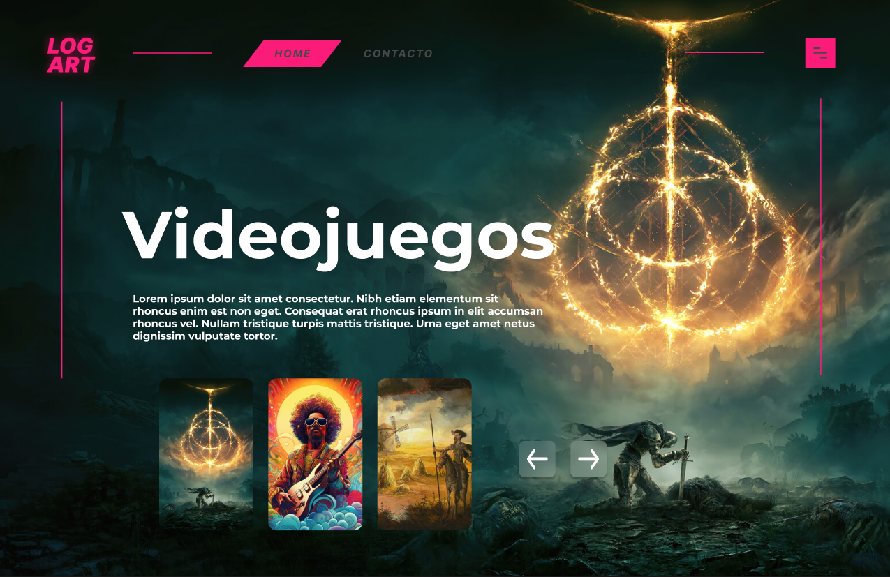

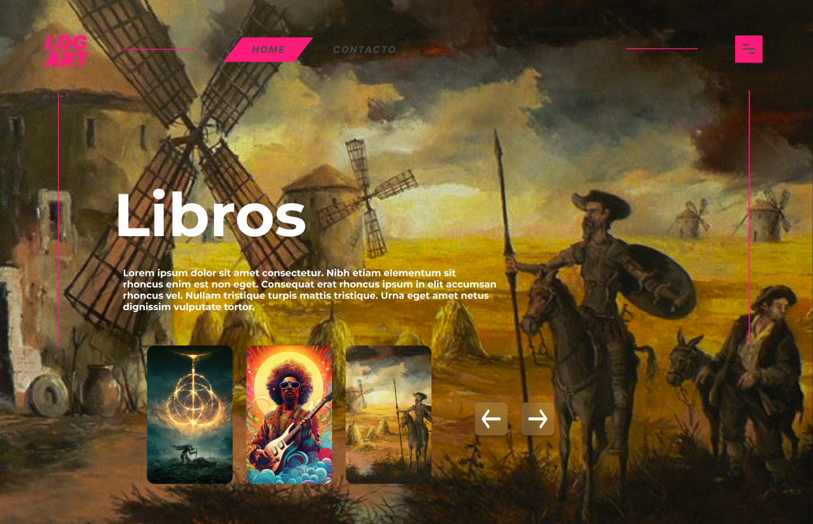

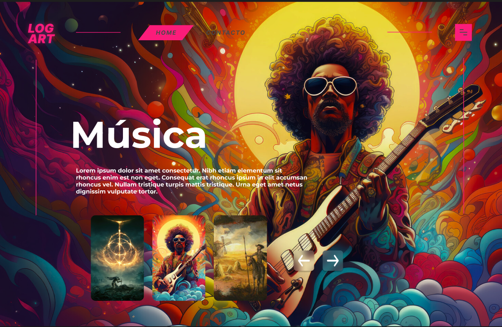

## Pantalla de Registro

 Se accede pulsando el botón en la pantalla de inicio
  
Aquí podremos registrarnos, para así usar la aplicación en su totalidad, creando objetos y comentarios sobre nuestra experiencia dentro de ellos.
  
Para registrarse necesitas un username, un email válido, y una contraseña. Es importante que el email sea correcto y verificable, ya que necesitarás superar una comprobación adicional vía mail para poder completar el registro. 

 

## Pantalla de Login

 Si ya estás registrado, puedes acceder a esta pantalla pulsando el botón correspondiente en la pestaña de registro.
  
Para logearse, será necesario introducir el username y la contraseña de tu usuario.
  
Es importante que el email esté validado antes de hacer el login, de lo contrario no podremos acceder a nuestra cuenta. 

 

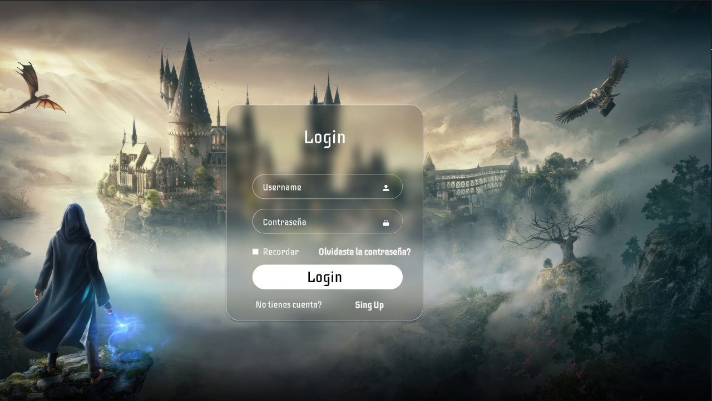

## Pantalla de La Biblioteca

 Una vez registrado y logeado, pasas a una pantalla intermedia, donde simplemente tendrás la opción de seleccionar la galería a la que quieres entrar primero.
  
Esta será la única vez que se verá la pantalla (por sesión), ya que después podrás cambiar entre galerías desde la propia galería.

 

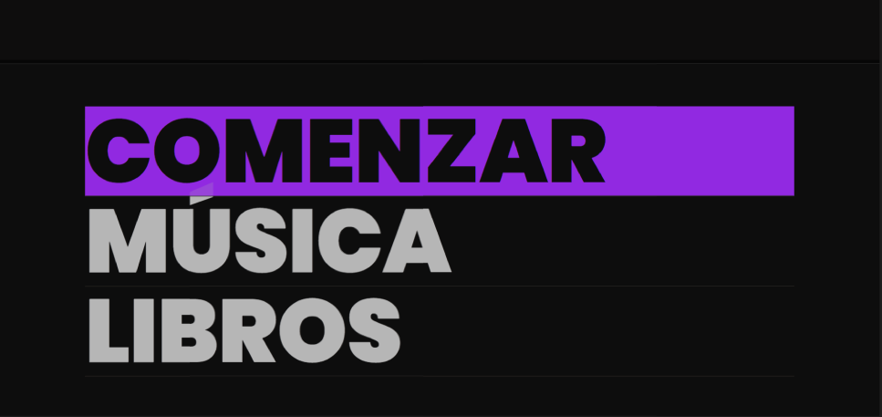

## Pantalla de La Galería

 Como mencionaba anteriormente, dentro de la propia galería tendremos la opción de cambiar entre ellas, pulsando el botón que a su vez reflejará el nombre de la galería en la que nos encontramos.
  
Al lado de ese botón, habrá otro para añadir nuevos objetos a la galería.
  
En cada uno de estos objetos aparecerá un nombre, una foto, un corazón para añadirlo a favoritos, una papelera para eliminar el objeto, y una opción para compartir el objeto con el resto de personas (usuarios y no usuarios de la aplicación) 

 

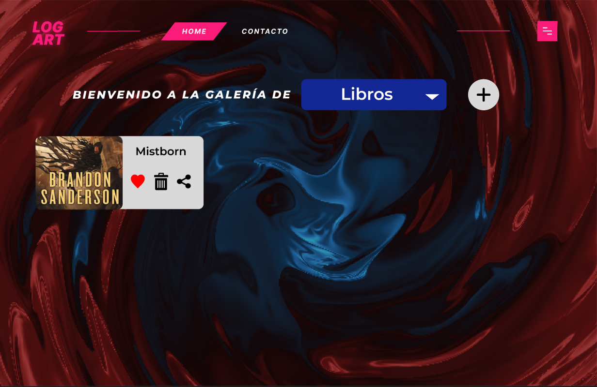
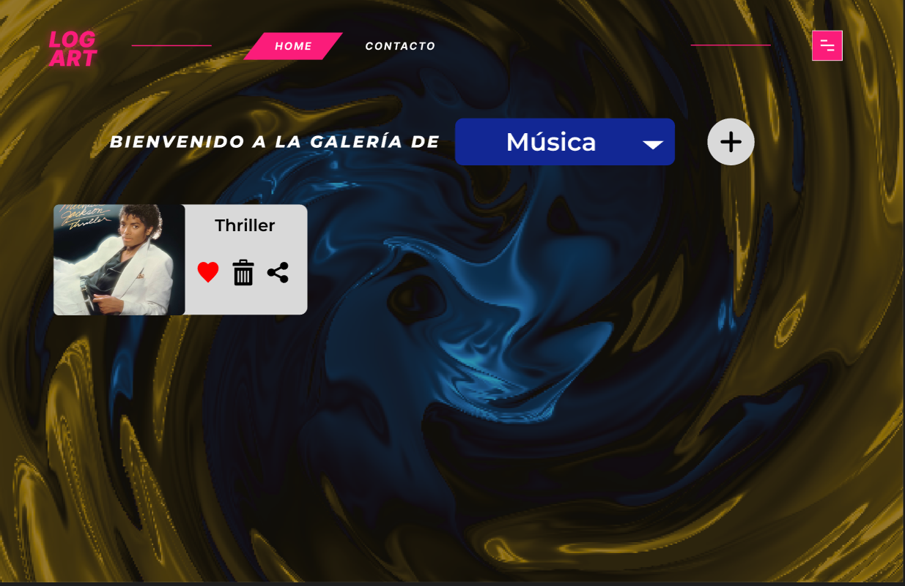

## Pantalla de Objeto concreto

 Al clicar en un objeto dentro de una galería, entraremos al objeto como tal. Donde podrás añadir la imagen de un mapa si es un videojuego, o los autores si se trata de un libro o una canción.
  
Además podrás publicar comentarios sobre tu experiencia con ese objeto.
  
Por último, también podrás editarlo, tanto el objeto en sí, (foto y nombre), como los comentarios/mapa/autores del objeto. 

 

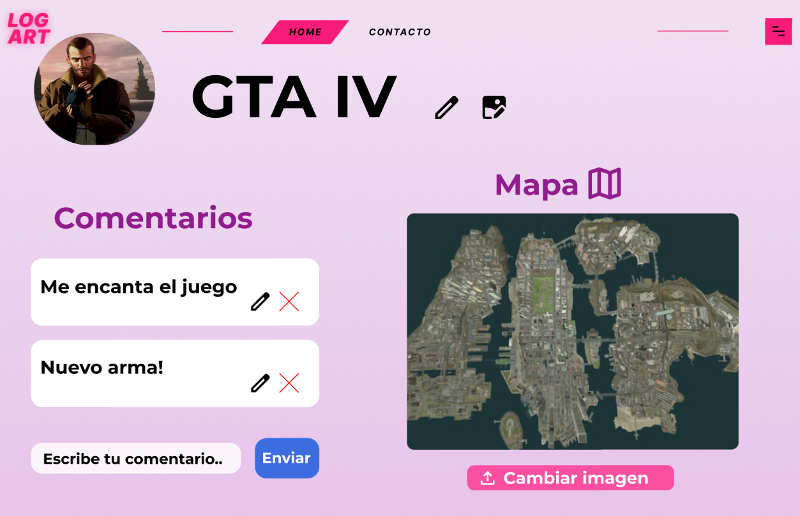
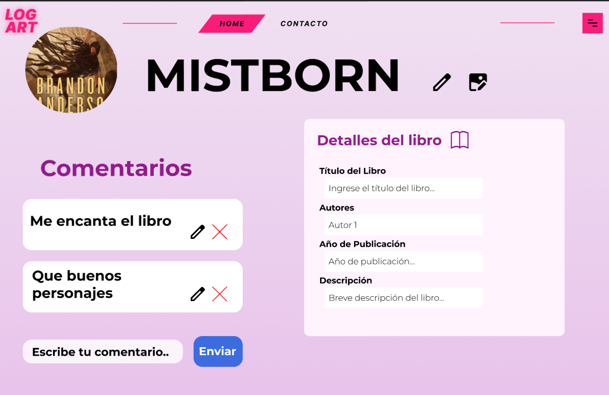
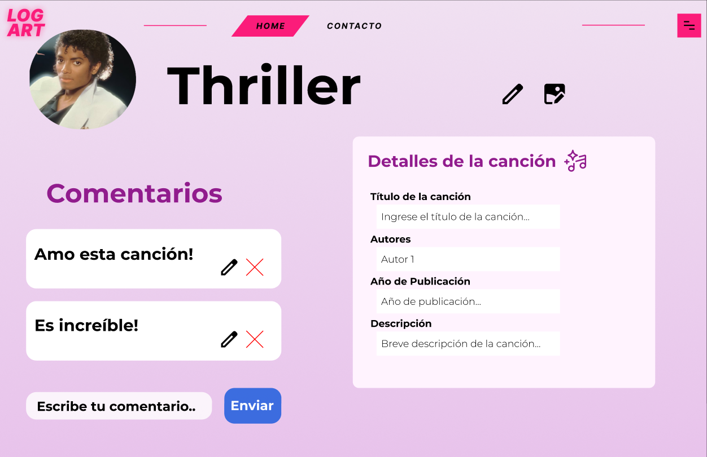

## Pantalla de Perfil

 En cualquier momento (y desde cualquier pantalla siempre que estés logeado), podrás acceder al perfil.
  
Para hacerlo clicaremos en el menú desplegable del header e iremos a perfil.
 

 

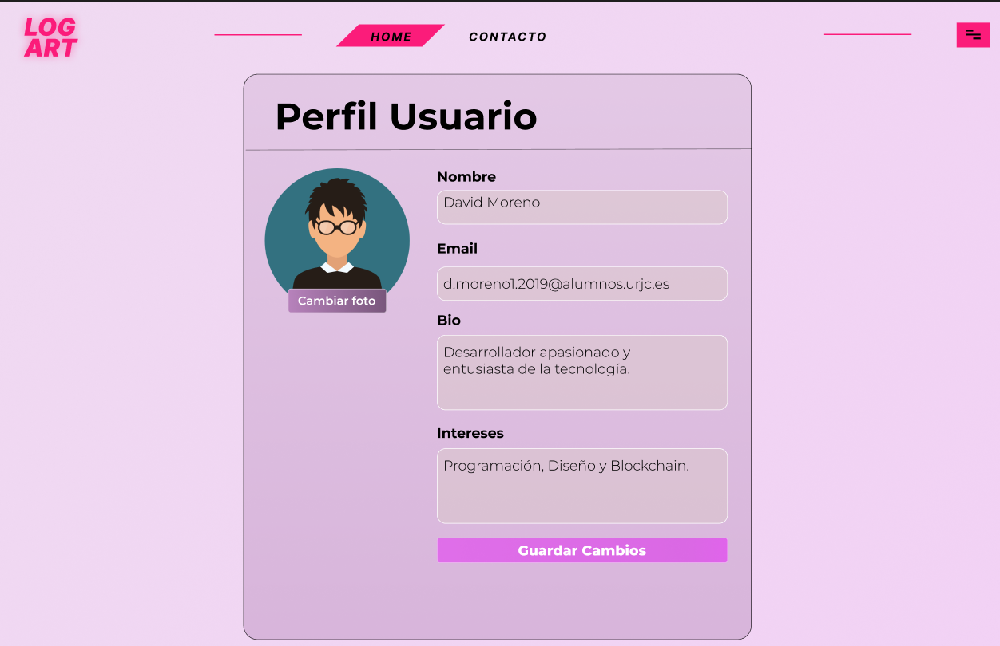

## Pantalla de Admin Dashboard

 Del mismo modo, si somos administradores, podremos ir al dashboard del administrador clicando en el menú del header.
  
Aquí se reflejarán una serie de estadísticas y gráficos ya comentados en la parte de "Gráficos" y "Algoritmo o consulta avanzada"
 

 

## Pantalla de Contacto

 Si clicamos en la parte de "Contacto" del header llegaremos a esta pantalla.
  
Aquí podremos obtener más información sobre los propietarios de la web.
 

 

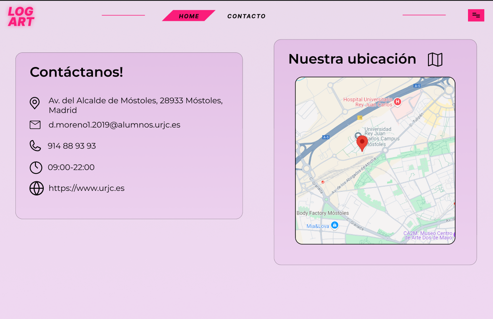

## Pantalla de Error 404

 Si en cualquier momento intentamos acceder a una URL no encontrada, nos mostrará la pantalla de error 404
 

 

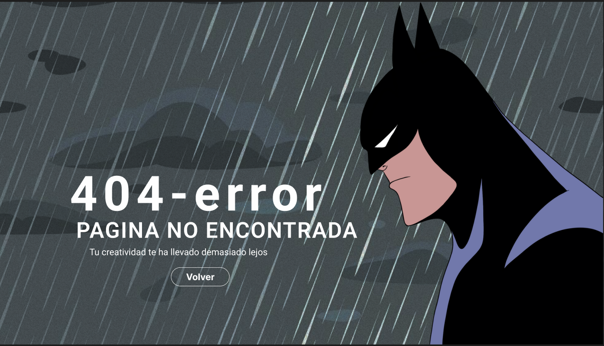