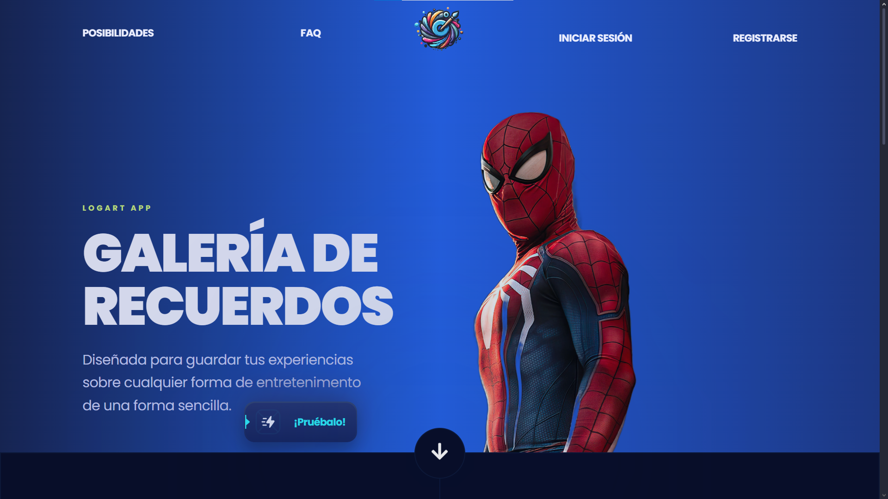
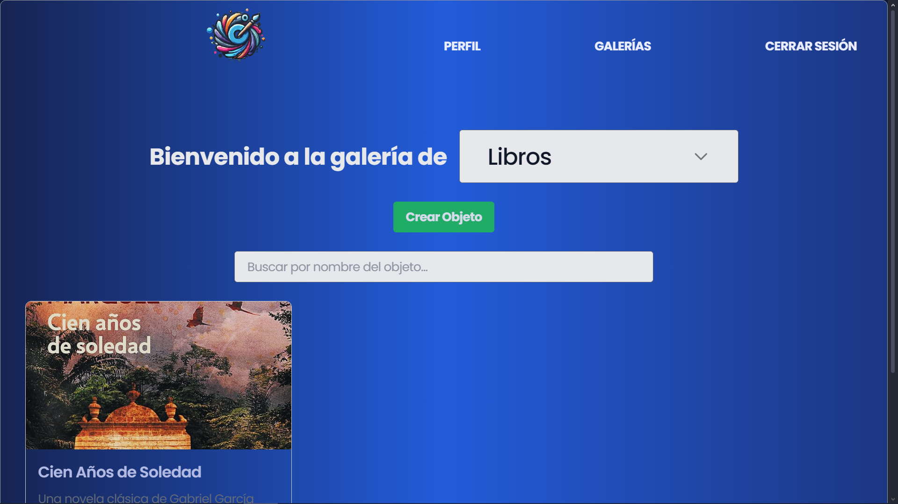
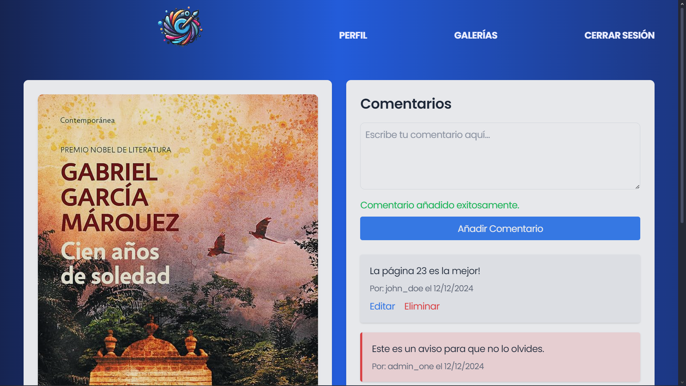

# LogArt

LogArt es una aplicación web que permite a los usuarios organizar y documentar sus experiencias con videojuegos, libros y canciones. La web facilita la creación de colecciones personalizadas donde los usuarios pueden añadir comentarios, imágenes y detalles específicos sobre cada obra.







### 📜 [Entradas del Blog sobre el desarrollo](https://medium.com/@davidmorenom17)

#### Enlaces a las otras secciones de la documentación:

- [Instrucciones de ejecución](docs/execution.md)
- [Funcionalidades](docs/functionalities.md)
- [Desarrollo](docs/development.md)
- [Diseño](docs/design.md)

Alumno: David Moreno Martín

Tutor: Micael Gallego Carrillo

### ▶️ Videos de demostración

- [LogArt Demo ](https://youtu.be/jGPRqOFaC10)

- [LogArt Demo en detalle ](https://youtu.be/c7ZoG5zqCQk)

## 📄 Memoria del Proyecto (TFG)

La memoria detallada de este Trabajo de Fin de Grado ha sido redactada íntegramente en **LaTeX**, siguiendo la normativa y plantilla oficial de la ETSII - URJC.

Los archivos correspondientes se encuentran organizados en el directorio `docs/` de la raíz del proyecto:

- 📁 **`docs/thesis/`**: Contiene la versión final compilada de la memoria lista para su lectura en formato PDF (`thesis.pdf`).
- 📁 **`docs/latex/`**: Contiene todo el código fuente en LaTeX, el archivo de bibliografía (`.bib`), la plantilla de la universidad y la carpeta de imágenes necesarias para generar el documento.

### 🛠️ Instrucciones de Compilación del PDF

Si deseas generar el documento PDF a partir del código fuente, puedes hacerlo de dos maneras:

#### Opción A: Mediante Overleaf (Recomendado)

1. Comprime todo el contenido de la carpeta `docs/latex/` en un archivo `.zip`.
2. Accede a [Overleaf](https://www.overleaf.com/) y selecciona _New Project_ -> _Upload Project_.
3. Sube el archivo `.zip`. Overleaf detectará automáticamente el documento principal y compilará el PDF sin necesidad de instalar nada en local.

#### Opción B: Compilación en Entorno Local

Para compilar el documento en tu propio equipo, necesitas tener instalada una distribución de LaTeX (como TeX Live, MacTeX o MiKTeX).

1. Abre una terminal y navega hasta el directorio del código fuente:
   ```bash
   cd docs/latex
   ```
2. Ejecuta la siguiente secuencia de comandos. Esta secuencia asegura que la bibliografía, los índices y las referencias cruzadas se generen correctamente:
   ```bash
   pdflatex tfg.tex
   bibtex tfg.aux
   pdflatex tfg.tex
   pdflatex tfg.tex
   ```
